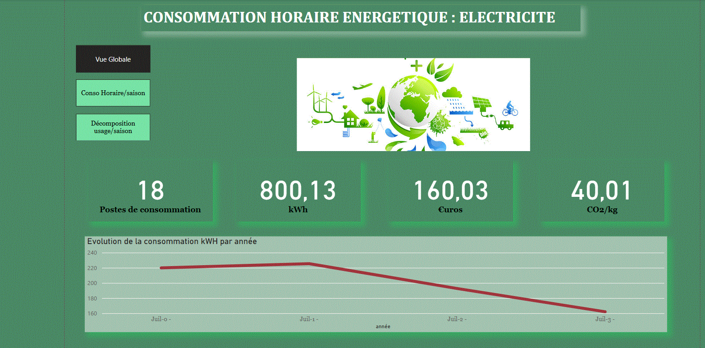

# Dashboard - Consommation Horaire Énergétique : Électricité ⚡🌱

## Présentation
Ce projet Power BI analyse la **consommation électrique horaire** de foyers français en mettant en évidence les **postes les plus énergivores**. L’objectif est d’identifier des **leviers d’optimisation** pour réduire la consommation, la facture et l’impact environnemental.

---

## Objectifs 🎯
- Visualiser la **consommation horaire par usage et par saison**.
- Identifier les **postes de consommation majeurs** (chauffage, froid, eau chaude…).
- Proposer des **recommandations** pour une consommation plus responsable.

---

## Données 📂
- **Source** : Données simulées à partir d’études ADEME / RTE.
- **Format** : Excel
- **Période** : Simulation annuelle par saison et par poste de consommation.

---

## Contenu du projet 📁
| Fichier | Description |
|---------|-------------|
| `Consommation_Electrique.pbix` | Rapport Power BI complet sur la consommation |
| `Conso_Donnees.xlsx` | Jeu de données utilisé pour l’analyse |
| `Conso.GIF` | Capture d’écran du dashboard Power BI |

---

## Aperçu du dashboard 📸

---

## Principaux enseignements 🔍
- **18 postes de consommation** étudiés.
- Consommation totale annuelle simulée : **800,13 kWh**
- Coût annuel estimé : **160,03 €**
- Émissions de CO₂ estimées : **40,01 kg**
- La consommation **diminue** sur la période étudiée grâce aux actions correctives (chauffage, heures creuses…).

---

## Recommandations 💡
✅ Prioriser l’usage des **heures creuses** pour le chauffage de l’eau et le lavage.  
✅ Limiter la consommation passive (veilles, appareils non utilisés).  
✅ Contrôler les postes froid (dégivrage, réglages corrects).  
✅ Suivre sa consommation **saison par saison** pour ajuster les usages.

---

## Auteur ✍️
👩‍💻 Annie Ivala  
🔗 [Mon LinkedIn](https://www.linkedin.com/in/annie-ivala)

---

## Licence 📜
Projet en libre accès pour consultation et inspiration.  
Merci de **mentionner l’auteure** si vous utilisez les contenus.

